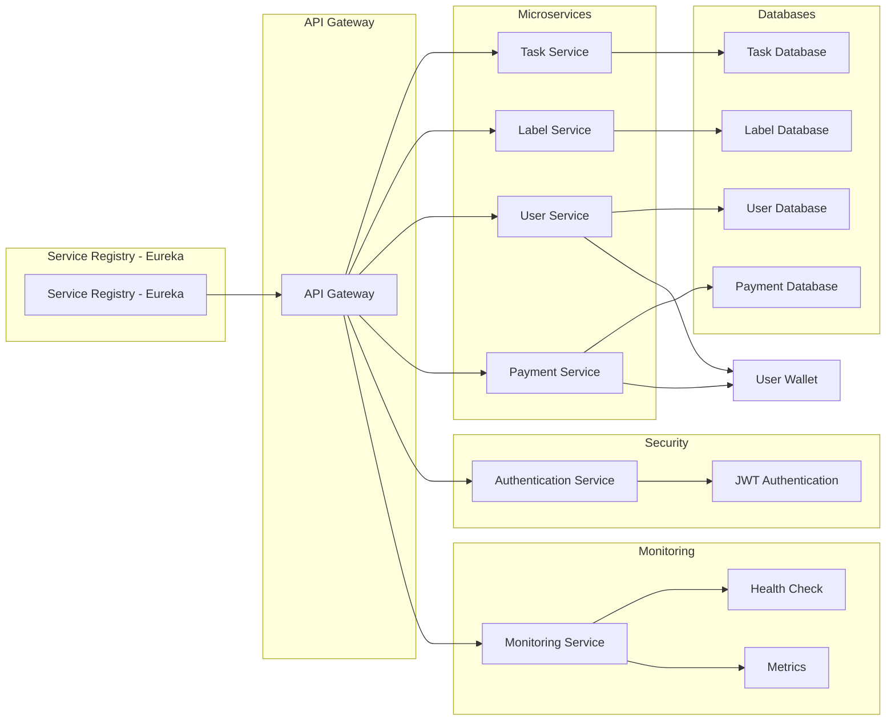

# Afrikai Microservices System

## 📖 Project Overview

The **Afrikai Microservices System** is a modular, scalable, and secure task management platform designed with a microservices architecture. It empowers users to manage tasks with labeling features while ensuring secure authentication and seamless inter-service communication. This system is built with **Spring Boot**, **Spring Cloud**, and **Netflix Eureka**, following industry best practices for distributed systems.

### 🎯 Core Objectives

- **Scalability:** Designed for horizontal scaling to handle increasing workloads.  
- **Modularity:** Decoupled services for maintainability and independent deployment.  
- **Security:** Role-Based Access Control (RBAC) with **JWT Authentication**.  
- **Resilience:** Fault-tolerant communication through service discovery and gateway routing.  

---

## 🏗️ Project Structure

```bash
afrikai_apis/
├── api-gateway/           # Centralized API Gateway for routing and security
├── docs/                  # Documentation for all microservices
├── label-service/         # Microservice for managing labels
├── service-registry/      # Eureka-based service discovery
├── task-service/          # Microservice for managing tasks
├── user-service/          # Handles user management and authentication
├── pom.xml                # Parent Maven configuration
└── README.md              # Project documentation
```

---

## ⚙️ Technology Stack

- Java 17

- Spring Boot 3.x

- Spring Cloud (Eureka, Gateway)

- Spring Security (JWT Authentication)

- MySQL (Database for services)

- Feign Clients for inter-service communication

- Maven (Build tool)

---

## 🔥 Core Features

### 🏷️ Label Management

Users can create, update, and delete labels to organize tasks.

### ✅ Task Management

Users can create tasks, assign labels, and manage task workflows.

### 🔐 User Authentication & Authorization

JWT-based authentication

Role-based access control (Client, Admin, Manager)


### 🔄 Service Discovery

Dynamic service registration and discovery using Netflix Eureka.

### 🚪 API Gateway

Central entry point for all services with routing and security handled by the Gateway.


---

## 🚀 Getting Started

### 📦 Prerequisites

Java 17

Maven 3.8+

MySQL running locally or in Docker (if you choose to run Docker for MySQL)

Docker (optional for deployment)


## 🔧 Setup Instructions

1. **Clone the Repository**
```
git clone https://github.com/Nadira3/afrikai_apis.git
cd afrikai_apis
```

2. **Configure Databases**

Ensure MySQL databases are created for each service:
```
user_service_db

task_service_db

label_service_db
```

Create these databases and update the connection configurations in application.yml files for each service with the correct username and password.


3. **Update Environment Variables**

Each service has its own application.yml or .env file. Configure database credentials and JWT secrets accordingly.


4. **Build the Project**
```
mvn clean install
```

5. **Run Services Individually**

Service Registry
```
cd service-registry
mvn spring-boot:run
```
API Gateway
```
cd api-gateway
mvn spring-boot:run
```
User Service
```
cd user-service
mvn spring-boot:run
```
Task Service
```
cd task-service
mvn spring-boot:run
```
Label Service
```
cd label-service
mvn spring-boot:run
```


6. **Verify Eureka Dashboard**
Visit http://localhost:8761 to confirm that all services are registered.


---

## 📡 API Overview

🔐 Authentication Endpoints (User Service)

✅ Task Management (Task Service)

🏷️ Label Management (Label Service)


---

## 🧪 Testing

### ✅ Running Tests

Execute unit and integration tests across all services:
```
mvn test
```
### 📝 Sample Test Case (User Authentication)
```
@Test
void whenValidUser_thenReturnsJwtToken() throws Exception {
    AuthRequest authRequest = new AuthRequest("user@example.com", "password123");
    
    mockMvc.perform(post("/api/auth/login")
            .contentType(MediaType.APPLICATION_JSON)
            .content(objectMapper.writeValueAsString(authRequest)))
        .andExpect(status().isOk())
        .andExpect(jsonPath("$.token").exists());
}
```

---

## 🌐 Architecture Diagram
**proposed design**


**exexcution flow**


## Key Workflow:

1. Service Discovery
All microservices register with Eureka Service Registry upon startup.


2. API Gateway
The API Gateway acts as the entry point for all incoming requests, routing them to the appropriate service based on the endpoint. It also handles authentication and authorization.


3. Communication between Services

Task Service communicates with Label Service and queries the MySQL database for task and label management.

User Service manages authentication, user details, and JWT generation.


---

## 🤝 Contribution Guidelines

1. Fork the repository.


2. Clone the forked repo.


3. Create a feature branch (git checkout -b feature/your-feature).


4. Commit changes (git commit -m "feat: add new feature").


5. Push to the branch (git push origin feature/your-feature).


6. Submit a Pull Request.


---

## 📄 License

Distributed under the ALX Backend Curriculum License.
